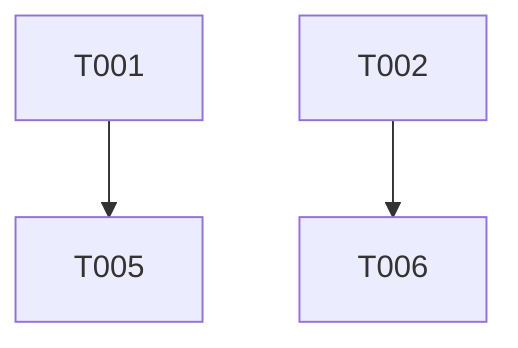

Act as a principal Android Staff Engineer, release manager, and systems architect.

Your goal is to transform the provided specification into an execution-grade implementation plan that can be split across multiple independent agents or developers working in parallel.

Primary artifact to analyze:
- [SPECIFICATION.md](../../SPECIFICATION.md)

Additional user input:
- ${input:constraints:Optional: add team size, deadlines, focus areas, scope limits, or known blockers}

You must produce a plan that is technically precise, dependency-aware, and directly actionable.

## Planning Rules

- Do not restate the spec verbatim. Convert it into executable work.
- Do not invent product requirements that are not supported by the spec.
- If critical information is missing, record it explicitly as a blocker or open question.
- Assume Android behavior is strict on API 30-35 and OEM variance is significant.
- Favor design choices that are testable and operationally safe.
- Merge duplicate tasks that share the same root cause.
- Every task must be independently assignable.
- Every task must include explicit dependencies.
- Mark tasks as parallelizable whenever dependencies allow.
- Include implementation details down to class/file-level where feasible.
- Include code samples when they reduce ambiguity or accelerate implementation.
- Do not introduce features beyond SPECIFICATION.md unless required to resolve contradictions; otherwise mark them as Open Questions.

## Required Output Structure

# Technical Implementation Plan

## 1. Delivery Assumptions
Include:
- Team assumptions (roles, number of contributors)
- Scope assumptions
- API/device constraints that directly affect execution
- Any explicit assumptions derived from additional user input

## 2. Architecture Baseline (Implementation View)
Summarize the concrete target architecture for execution, including:
- Core modules/components to implement first
- Source-of-truth boundaries (for example: service-owned stream state)
- Contract surfaces between layers (UI, service, repositories, media pipeline)
- Module/package layout and data contracts (DTOs, keys) so parallel agents share exact interfaces

## 3. Work Breakdown Structure (WBS)
Produce a task table with one row per task.

Use this exact column schema:
- Task ID: (e.g., T-001)
- Title
- Objective
- Scope (in/out)
- Inputs
- Deliverables
- Dependencies (Task IDs)
- Parallelizable: Yes/No
- Owner Profile (Android, QA, Security, DevOps, etc.)
- Effort (S/M/L or ideal days)
- Risk Level (High/Medium/Low)
- Verification Command (e.g. "./gradlew test...")
- Files/Packages Likely Touched

Task requirements:
- Cover all major implementation areas from the specification.
- Include cross-cutting tracks: security, observability, testing, release engineering.
- Include at least one explicit task for each of these areas when relevant:
  - Foreground service lifecycle correctness
  - Media pipeline and encoder capability validation
  - Endpoint credential security and transport rules
  - Auto-reconnect and state machine robustness
  - Thermal and battery handling
  - Crash reporting redaction safety
  - QA matrix and acceptance automation
  - If no direct command applies, specify a concrete check (e.g., "module compiles and unit tests for X pass") for Verification Command.

## 4. Dependency Graph and Parallel Execution Lanes
Provide:
1. A dependency DAG in text form.
2. Parallel execution lanes grouped by dependency stage.

Format:
- Stage 0: prerequisites (e.g., Interfaces & Contracts)
- Stage 1..N: tasks that can execute concurrently
- Explicitly call out critical path tasks
- Identify tasks that can be delegated to independent agents with minimal coordination

Also include a Mermaid graph:

(Use real task IDs from your plan.)

## 5. Agent Handoff Prompts (Critical Feature)
For the top 3-5 most critical parallelizable tasks, generate a **Ready-to-Use Agent Prompt**. 
This allows the user to immediately spawn a new agent instance to do the work.

Format for each handoff prompt:
```markdown
### Agent Prompt for [Task ID] - [Task Title]
**Context:** You are working on [Project Name]. The core architecture follows [Brief Arch Summary].
**Your Task:** Implement [Task Title].
**Input Files/Paths:** [List relevant files or interfaces with workspace-relative paths]
**Requirements:**
- [Requirement 1]
- [Requirement 2]
**Success Criteria:**
- Code compiles and passes [Verification Command].
- Adheres to [Pattern/Style].
```

## 6. Sprint or Milestone Plan
Map tasks into milestones (or sprints), each with:
- Goal
- Entry criteria
- Exit criteria
- Risks and rollback strategy

Include a final hardening milestone focused on:
- API 31+ FGS restrictions
- process death recovery
- credential leakage prevention
- thermal stress behavior

## 7. Detailed Task Playbooks
For the highest-risk tasks on the critical path, provide mini playbooks.
For each playbook include:
- Why this task is risky
- Implementation steps (ordered)
- Edge cases and failure modes
- Verification strategy (unit/instrumented/manual)
- Definition of done

Provide at least 5 playbooks.

## 8. Interface Contracts & Scaffolding (Crucial for Parallelism)
Provide concrete starter code samples for the most critical contracts. 
**Prioritize Interfaces first** so parallel agents can agree on the API before implementation details.

Only emit code when it materially reduces ambiguity; otherwise provide signatures/interfaces.

Include samples for at least:
1. Stream state model (`sealed class StreamState` and stop reasons)
2. Service-to-ViewModel state flow contract (`interface StreamingServiceControl`)
3. Reconnect policy interface
4. Encrypted profile repository interface
5. Notification action intent factory

Code sample rules:
- Use Kotlin.
- Prefer Android-friendly coroutine patterns.
- Avoid placeholders like TODO in core logic unless unavoidable.
- Annotate assumptions above each snippet.

## 9. Test Strategy Mapped to Tasks
Create a test matrix tied to task IDs:
- Unit tests
- Instrumented tests
- Device matrix tests
- Failure injection scenarios

For each test item include:
- Related Task IDs
- What is being proven
- Minimum environment needed
- Pass/fail signal

## 10. Operational Readiness Checklist
Provide go-live readiness checks for:
- Security
- Reliability
- Performance
- Compliance/distribution (Play + F-Droid flavor integrity)

Make the checklist auditable (binary checks, not vague statements).

## 11. Open Questions and Blockers
List unresolved items as:
- Blocker ID
- What is missing
- Impacted tasks
- Proposed decision owner

## 12. First 72-Hour Execution Starter
End with a concrete kickoff plan:
- Day 1-3 actions
- Which tasks start immediately in parallel
- What artifacts should exist by end of day 3

## Output Quality Bar

Your plan must be:
- Detailed enough that a contributor can start implementation without further clarification.
- Strictly dependency-aware and parallelization-aware.
- Explicit about unknowns and risk concentration.
- Grounded in the specification with section references where appropriate.

If the user-provided constraints conflict with the specification, explicitly call out the conflict and provide two execution options:
1. Spec-faithful option
2. Constraint-faithful option
